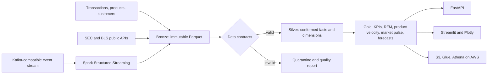

# MERCHMIND

Cloud-native fashion retail intelligence for deciding **what to buy, what to mark down, and where inventory risk is building**.

MERCHMIND turns noisy transaction, customer, product, public-company, and macroeconomic data into a governed analytical layer for merchandisers and market analysts. The repository is deliberately end to end: a reproducible data generator, Bronze/Silver/Gold pipeline, quality quarantine, customer and product analytics, demand forecasts, public-data connectors, Kafka/Spark streaming, API, dashboard, tests, containers, CI, and AWS infrastructure as code.

> The demo uses synthetic retailers and customers. It contains no scraped, proprietary, or personally identifiable data. Optional SEC and BLS adapters make the boundary between demo data and real public data explicit.

## What it answers

- Which categories create revenue and gross profit, and how are returns and markdowns changing them?
- Which products are slow movers relative to their own category velocity?
- Which customer cohorts are loyal, at risk, newly acquired, or still developing?
- What is the next 28 days of unit demand by category, with an interpretable uncertainty range?
- Which public fashion companies show inventory growth outpacing sales and margin performance?
- Did bad source records enter decision-facing tables, or were they quarantined with an audit trail?

## Architecture



The local implementation uses Parquet so anyone can run it without a cloud bill. Terraform maps the same medallion layers to encrypted, versioned S3 storage, a Glue catalog, Athena, EMR Serverless, CloudWatch, and an optional MSK Serverless stream.

## Reference run

A local 50,000-transaction run with 2,500 customers and 500 products produced 50,200 source rows after injected duplicates. It admitted 49,400 trusted rows, quarantined 800 contract failures, and built six Gold data products in 0.29 seconds (runtime varies by machine). That is a 98.41% measured data-quality pass rate; the analytical outputs contained 110 slow-mover flags and 224 category forecast rows.

## Quick start

Requires Python 3.11+.

```bash
python -m venv .venv
source .venv/bin/activate
pip install -e '.[dev]'
merchmind run --transactions 50000 --customers 2500 --products 500
merchmind summary
```

Launch the two serving surfaces:

```bash
uvicorn merchmind.api:app --reload
streamlit run src/merchmind/dashboard.py
```

- API documentation: `http://localhost:8000/docs`
- Dashboard: `http://localhost:8501`

On Streamlit Community Cloud, the dashboard creates the same deterministic 50,000-transaction demo dataset automatically at its first startup; no data files need to be committed.

Or build the pipeline, API, dashboard, and Kafka-compatible broker together:

```bash
docker compose up --build
```

The Compose environment also loads the conformed tables into PostgreSQL. `sql/postgres` defines normalized dimensions and a transaction fact with primary/foreign keys, checks, and composite indexes. Its analytical views use `SUM OVER`, `PERCENT_RANK`, and `NTILE` windows for rolling product velocity and RFM segmentation.

## Data products

| Layer | Output | Grain and purpose |
|---|---|---|
| Bronze | `transactions`, `products`, `customers` | Source-shaped, immutable inputs |
| Bronze | `company_financials`, `macro_indicators` | Quarterly company and monthly market signals |
| Silver | `fact_transactions` | Valid transaction line after contract checks |
| Silver | `dim_products`, `dim_customers` | Conformed descriptive entities |
| Gold | `daily_category_performance` | Date × category merchandising KPIs |
| Gold | `product_performance` | Product velocity, margin, returns, and slow-mover flags |
| Gold | `customer_rfm` | Customer-level behavioral value and lifecycle segment |
| Gold | `market_pulse` | Company-quarter inventory stress with macro context |
| Gold | `category_forecast` | Category-day 28-day unit forecast and 80% interval |

Every run also writes a quality report and a manifest containing row counts, layer contents, configuration, runtime, and generation timestamp.

## Data quality and modeling choices

The generator deliberately injects missing keys, invalid quantities, negative prices, and duplicate transaction IDs. Records that violate contracts never enter Silver: they retain a pipe-delimited rejection reason in the quarantine table. The quality report makes the pass rate and every failure class measurable.

The 28-day baseline uses weekday seasonal behavior from the trailing 84 days. It is transparent enough for a merchandiser to challenge and creates an honest benchmark for later gradient-boosted or hierarchical forecasting. Inventory stress is also interpretable:

```text
inventory growth YoY − revenue growth YoY − gross-margin change YoY
```

A high value means inventory is expanding faster than demand while margin is deteriorating—a practical signal to investigate, not a claim of investment advice.

See [methodology](docs/methodology.md), [data model](docs/data_model.md), and [AWS deployment](docs/aws_deployment.md) for the detailed design.

## Public-data adapters

`merchmind.connectors` includes small, testable clients for:

- [SEC EDGAR Company Facts](https://www.sec.gov/edgar/sec-api-documentation), for standardized public-company XBRL facts.
- [BLS Public Data API](https://www.bls.gov/developers/), for apparel CPI, employment, and related labor-market context.

The SEC requires an identifying user agent containing contact information. Credentials and identifying values belong in environment variables or a secret manager and are never committed. Potential Census retail and licensed trend/search sources are documented as extensions rather than represented as data already present.

## Streaming path

Install the optional producer dependency and start the local broker:

```bash
pip install -e '.[streaming]'
docker compose up -d kafka
python -m merchmind.streaming --input data/silver/fact_transactions.parquet
```

`jobs/spark/transaction_stream.py` consumes those events with Spark Structured Streaming, applies a watermark, and writes five-minute channel aggregates plus checkpoints. Redpanda supplies a lightweight Kafka-compatible local broker; the optional Terraform module provisions Amazon MSK Serverless for the cloud version.

## Engineering workflow

```bash
make format
make lint
make test
```

GitHub Actions repeats linting and tests, then exercises a 5,000-transaction pipeline run. Unit tests cover deterministic generation, validation and quarantine behavior, medallion outputs, API contracts, forecasts, and mocked public-data clients without relying on live network calls.

## Cloud deployment

The Terraform is intentionally safe by default: remote storage, catalog, Athena, EMR Serverless, and observability are created, while MSK Serverless is opt-in because it can incur meaningful cost.

```bash
cd infrastructure/terraform
terraform init
terraform plan -var='project_name=merchmind-dev'
terraform apply -var='project_name=merchmind-dev'
```

Review the plan and your AWS account's current pricing before applying. Terraform state may contain infrastructure metadata and must not be committed.

## Roadmap

- Backtest the baseline against LightGBM and hierarchical forecasts using rolling-origin evaluation.
- Add dbt models and Great Expectations contracts over Athena or a warehouse.
- Add event-time anomaly alerts for returns, discount depth, and demand spikes.
- Join SEC filings to real apparel CPI and retail-sales series, preserving source lineage and release dates.
- Add an optimization layer for open-to-buy allocation under inventory, margin, and service-level constraints.

## License

MIT. Built by [Akshaya Jayakanth](https://akshaya-jayakanth-portfolio.vercel.app).
