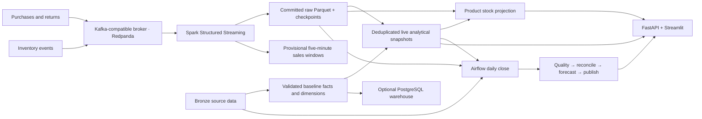

# MERCHMIND

[](https://github.com/akshayajay/merchmind/actions/workflows/ci.yml)

**A retail data platform for streaming sales, tracking product stock, and reconciling daily reports.**

MERCHMIND combines Kafka-compatible ingestion, Apache Spark Structured Streaming, Apache Airflow workflows, and a FastAPI/Streamlit application. It answers what sold, which products are running low, and whether daily reported transactions and revenue match the source records—even after duplicates, late arrivals, or interrupted jobs.

The reproducible demo uses **synthetic retail data** and runs locally in Docker. Its broker is **Redpanda, implementing the Kafka protocol**. Spark handles streaming ingestion and window aggregation; pandas handles analytical tables, reconciliation, and stock projection. AWS infrastructure is an undeployed design. Hadoop/HDFS/YARN are not implemented.

## Platform capabilities

| Capability | Implementation |
|---|---|
| Event ingestion | Acknowledged Kafka producers, transaction/inventory topics, durable Spark checkpoints |
| Streaming analytics | Raw Parquet audit log and five-minute channel windows with a ten-minute watermark |
| Live serving | Validation, business-ID deduplication, atomic analytical snapshots, dashboard refresh |
| Inventory | Opening balances, receipts, adjustments, sales, restockable returns, low-stock flags |
| Daily close | Airflow quality checks, source-to-serving reconciliation, forecast refresh, atomic publication |
| Recovery and backfills | Checkpoint recovery, task retries, historical reruns, last-successful-report preservation |
| Retail analytics | Category revenue, product velocity, customer RFM, company stress, demand forecasts |
| SQL warehouse | Optional PostgreSQL facts/dimensions, constraints, indexes, and window-function views |

## Architecture



The daily close uses **committed raw history**, so late transactions can be included when their business date is rerun. Finalized streaming windows remain provisional analytical outputs.

## Run the full demo

Install Docker Desktop or Docker Engine with Compose. **8 GB of Docker memory is a practical starting point** for Airflow, two Spark consumers, and serving services. First setup downloads images, Python packages, and the Spark Kafka connector.

```bash
git clone https://github.com/akshayajay/merchmind.git
cd merchmind
make retail-demo
```

| Service | Local URL |
|---|---|
| Dashboard | [localhost:8501](http://localhost:8501) |
| API documentation | [localhost:8000/docs](http://localhost:8000/docs) |
| Airflow | [localhost:8080](http://localhost:8080) |

The demo generates 25,000 transactions before injecting quality problems, seeds 500 opening units per product, and replays validated transactions and inventory events. Replaying baseline transactions exercises ingestion without inflating served revenue. The dashboard refreshes every five seconds; processing adds to end-to-end latency.

Airflow's `retail_daily_close` DAG starts paused. Retrieve its generated local login from the service logs, then unpause it in the UI:

```bash
make retail-logs
```

Each midnight UTC run closes the **preceding UTC day**. Synthetic sales cover 2024–2025, so current-date closes may be empty. After the initial replay finishes, trigger a historical run with:

```json
{"business_date": "2025-12-30"}
```

Use Airflow's Backfill action to rerun a historical range. Successful reports appear in the dashboard and at `/v1/daily-close/YYYY-MM-DD`; stock is available at `/v1/stock`.

```bash
make retail-status
make retail-stop       # Preserve data and checkpoints.
```

The local stack bind-mounts application source read-only. Stop it before regenerating baseline data; never run two writers against the same checkpoints. See the [platform guide](docs/retail-platform.md) and [operations guide](docs/operations.md).

## Smaller Python-only demo

Requires Python 3.11+. This runs batch analytics and the app without Kafka, Spark, or Airflow:

```bash
python -m venv .venv
source .venv/bin/activate
pip install -e '.[dev]'
make demo
make api               # Separate terminal: make dashboard
```

Streamlit Community Cloud can generate this batch demo on first startup; it does not run the Docker streaming/Airflow stack. `docker compose up --build` runs the original batch/application/PostgreSQL setup. Use `make retail-demo` for the full platform.

## Data and correctness

| Layer | Contents |
|---|---|
| Bronze | Source transactions, products/customers, company/macro inputs, inventory events; replaced by generator reruns |
| Silver | Validated transaction lines and conformed dimensions; rejected rows retain reasons |
| Gold | Category metrics, product performance, customer RFM, market pulse, forecasts, executive KPIs |
| Live snapshots | Complete analytical outputs exposed through one atomic pointer |
| Daily closes | Pinned inputs, record/category comparisons, quality evidence, date-bounded forecasts, successful-attempt pointer |
| Stock snapshots | Per-product quantities; missing inventory means unknown stock, not zero |

Transaction IDs are immutable: baseline records take precedence, followed by the first valid streamed record. An invalid first arrival does not block a later valid event. Inventory IDs ignore exact duplicates and reject conflicting payloads. Returns reverse revenue; the stock demo assumes returned units are restockable. Unit prices are already discounted. See the [data model](docs/data_model.md) and [methodology](docs/methodology.md).

## Verified execution

Recorded local verification on September 20, 2026:

| Check | Observed result |
|---|---|
| Application tests | 38 passed; **88.61% coverage** ([saved CI summary](docs/verification/application-tests-2026-09-20.md)) |
| Real broker + Spark | Checkpoint restarts, forced-driver-crash recovery, duplicates, and late arrivals passed |
| Airflow tasks | Four successful runs; an injected failure exhausted three attempts, preserved the previous close, then recovered |
| Full-stack scheduler | 24,700 committed stream events; selected day reconciled 33 transactions, 37 units, and $1,564.96 |
| Live inventory | Duplicate stock adjustment produced one balance change; API and browser showed five units and a low-stock flag |

These are test observations, not throughput or production-availability claims. See the [execution report and machine-readable evidence](docs/verification/retail-platform-validation.md). Older experiments remain separately dated in [validation](docs/validation.md).

The application-test figures correspond to commit [`2f0c281`](https://github.com/akshayajay/merchmind/commit/2f0c281ca0f7ec8c7802aa41f7ad0aa8f4d695f7) in [PR #3](https://github.com/akshayajay/merchmind/pull/3). The [saved CI summary](docs/verification/application-tests-2026-09-20.md) preserves the coverage table, test counts, measurement scope, and original Actions run reference. This is a dated coverage snapshot, separate from the live CI status badge above.

**Earlier streaming reconciliation — September 19, 2026:** the implementation and evidence committed as [`49cff7d`](https://github.com/akshayajay/merchmind/commit/49cff7d435035222e1b4afee15ca5b09753f8747) in [PR #1](https://github.com/akshayajay/merchmind/pull/1) recorded **49,400 broker-confirmed events** consumed across three partitions. All 44,687 finalized windows, covering 49,398 transactions, matched batch calculations; two transactions remained pending behind the watermark. See the [revision-pinned evidence](https://github.com/akshayajay/merchmind/blob/49cff7d435035222e1b4afee15ca5b09753f8747/docs/streaming-verification.json) and [reproduction instructions at that revision](https://github.com/akshayajay/merchmind/blob/49cff7d435035222e1b4afee15ca5b09753f8747/docs/streaming.md). This was a local execution check, not a throughput benchmark.

```bash
make lint
make test
make airflow-test       # Actual Airflow tasks; isolated synthetic commit-file fixtures.
make streaming-test     # Real broker and Spark, daily close, and stock API.
make compose-check      # Validate the combined stack configuration.
```

GitHub Actions runs application/SQL validation, Airflow verification, and broker/Spark integration. The badge links to current remote results; local reports do not establish the result of a specific GitHub Actions run.

## Forecasts and public-data adapters

The demand baseline uses matching weekdays from the trailing 84 days. The dated synthetic backtest measured **29.40% WAPE**, versus **28.78%** for a trailing 28-day mean, with **75.21% coverage** for its nominal 80% band. It did not beat the mean baseline. Run `merchmind backtest --data-dir data` to evaluate your dataset; these figures do not establish real-retailer accuracy.

Optional SEC EDGAR and BLS clients are separate from the synthetic pipeline. They do not automatically feed the streaming demo. Keep identifying headers and credentials in local configuration. [Methodology and source boundaries](docs/methodology.md).

## Repository map

| Path | Purpose |
|---|---|
| `src/merchmind/` | Analytics, contracts, publishers, reconciliation, API, dashboard |
| `dags/` | Airflow task graph and UTC daily schedule |
| `jobs/spark/` | Transaction windows and raw inventory ingestion |
| `scripts/` | Launchers, orchestration checks, resilience experiments |
| `tests/` | Unit, application, and real broker/Spark integration tests |
| `sql/postgres/` | Warehouse schema and analytical views |
| `docker-compose*.yml` | Batch, streaming, Airflow, inventory, optional resilience services |
| `docs/` | Architecture, operations, contracts, execution evidence |
| `infrastructure/terraform/` | Undeployed AWS design |

## Limits and next steps

The normal demo uses one Docker host and one broker. Analytical rebuilding, reconciliation, and stock projection scan retained history with pandas. PostgreSQL is batch-loaded; dimensions stay fixed while streaming. Configure retention before long runs. The five-minute windows do not apply the full reference-aware validation used by live serving.

AWS deployment is deferred, and Terraform does not deploy the Airflow/stock application. See [AWS design and gaps](docs/aws_deployment.md). Next steps include incremental reconciliation, explicit retention, automated late-date reprocessing, inventory-aware forecasts, and warehouse model transformations.

## License

MIT. Built by [Akshaya Jayakanth](https://akshaya-jayakanth-portfolio.vercel.app).
