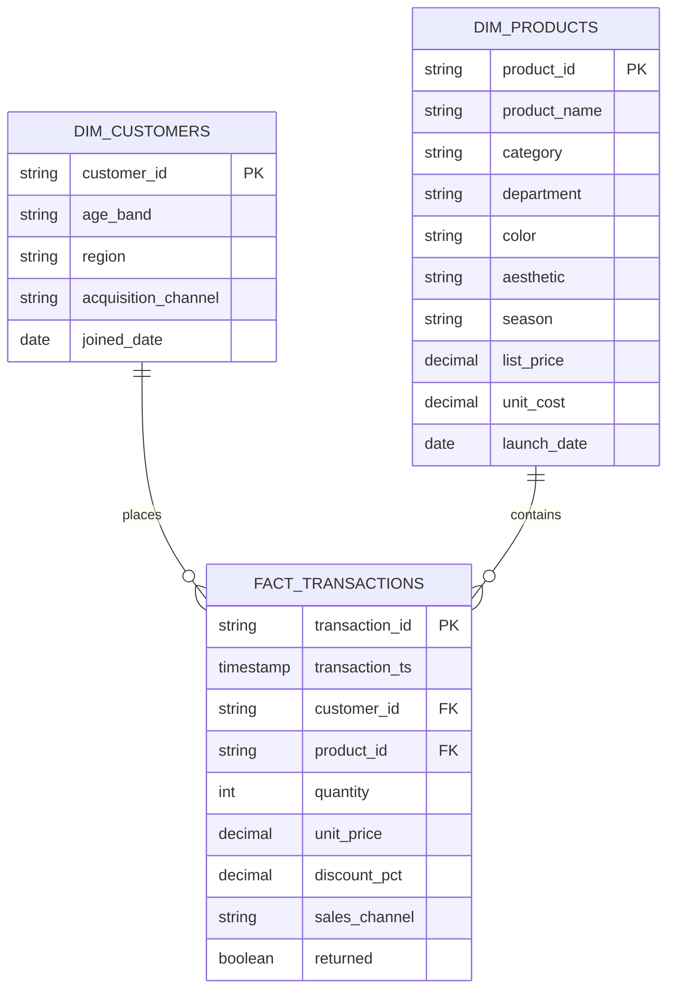

# Data model

MERCHMIND uses a compact dimensional model. Source-shaped Bronze objects are immutable; rejected records are preserved separately; Silver holds trusted facts and dimensions; Gold holds purpose-built decision tables.

## Core model

## Grain and invariants

`fact_transactions` has one row per transaction line. Transaction ID is unique in this demo. Quantity must be positive, price nonnegative, event time parseable, required IDs present, and product/customer references valid. Because the model includes returns on the same grain, net revenue and gross profit reverse when `returned=true`.

The synthetic customer table deliberately uses only broad age bands and regions. It does not create names, email addresses, street addresses, or other direct identifiers.

## Gold tables

- `daily_category_performance`: one row per date and category.
- `product_performance`: one row per product across the observed period.
- `customer_rfm`: one row per purchasing customer at the pipeline reference date.
- `market_pulse`: one row per company-quarter, enriched with the latest available monthly macro observation.
- `category_forecast`: one row per future date and category for a 28-day horizon.

The Gold tables are denormalized intentionally. They optimize stable API and dashboard reads while the conformed Silver layer remains the reusable source of truth.
