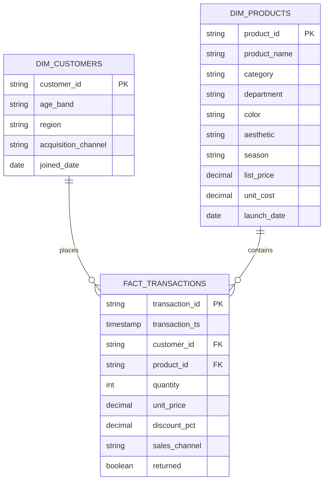

# Data model

MERCHMIND uses a compact dimensional model. Generator reruns replace source-shaped Bronze files; Spark's committed raw files form the retained event audit log. Rejected records are preserved separately; Silver holds trusted facts and dimensions; Gold holds decision tables. Baseline files and dimensions must remain fixed while streaming and reconciliation are active.

## Core model

## Grain and invariants

`fact_transactions` has one row per transaction line. Transaction ID is unique in this demo. Quantity must be positive, price nonnegative, event time parseable, required IDs present, and product/customer references valid. Because the model includes returns on the same grain, net revenue and gross profit reverse when `returned=true`.

The synthetic customer table deliberately uses only broad age bands and regions. It does not create names, email addresses, street addresses, or other direct identifiers.

## Gold tables

- `daily_category_performance`: one row per date and category.
- `product_performance`: one row per product across the observed period.
- `customer_rfm`: one row per purchasing customer at the pipeline reference date.
- `market_pulse`: one row per company-quarter, enriched with the latest available monthly macro observation.
- `category_forecast`: one row per future date and category for a 28-day horizon.

The Gold tables are denormalized intentionally. They optimize stable API and dashboard reads while the conformed Silver layer remains the reusable source of truth.

## Event and operational models

| Dataset | Grain / key | Fields and contract |
|---|---|---|
| Transaction Kafka envelope | topic × partition × offset | Original value, key, Kafka timestamp; malformed and late payloads remain auditable |
| Transaction payload | transaction_id | Core fact fields above; baseline takes precedence, then the first valid event; later corrections need new IDs |
| Inventory payload | event_id | event_ts, product_id, kind, quantity_delta; kind is opening, receipt, or adjustment |
| Stock projection | product_id | on_hand, sold_units, restocked_return_units, low_stock, stock_status; joined product descriptors |
| Daily close | UTC business_date × attempt | Source/serving revision, expected/actual totals, quality gate, forecasts, publication timestamp |

Inventory quantities are finite integers. Opening balances and receipts are nonnegative;
adjustments may be signed. Each tracked product has exactly one opening event. Events
before that opening and conflicting payloads for one event ID fail publication.
Identical inventory events at new Kafka offsets count once. Unknown stock is omitted.

Daily close attempts pin their input records and files. Reconciliation compares all
transaction fields and category-level orders, units, and net revenue. The successful
date pointer changes atomically; failed attempts remain available for diagnosis.

## Storage and serving

- `live/current.json` → `live/snapshots/<revision>/`: transaction/analytical snapshot.
- `inventory/current.json` → `inventory/snapshots/<revision>/stock.parquet`: stock snapshot.
- `closes/YYYY-MM-DD/current.json`: successful report and attempt identifier.
- `closes/YYYY-MM-DD/attempts/<id>/`: pinned tables, quality/reconciliation evidence, forecasts.

These pointers publish independently. A response or dashboard render reads a consistent
transaction snapshot; stock and close reports may refer to earlier revisions. See
[operations](operations.md) for path mappings and retained state. PostgreSQL currently
loads baseline tables only; operational snapshots are not synchronized into it.
