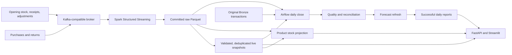

# Retail streaming, inventory, and daily close

Merchmind combines a Kafka-compatible event stream, Spark's committed Parquet audit log,
live retail analytics, product stock balances, and an Airflow daily close. All default
data is synthetic. The Docker deployment is a local learning/demo environment.



## Run locally

From this checkout, with Docker Desktop running:

```bash
make retail-demo
```

This initializes the synthetic retail dataset, replays transactions and inventory events,
starts two Spark consumers, and starts the publishers, API, dashboard, and Airflow.
The local demo bind-mounts application source read-only into the serving and Airflow
containers so they share the checkout's code. Each Spark consumer has its own Ivy cache.
The broker is **Redpanda**, which implements the Kafka protocol; do not describe this
local test as an Apache Kafka broker deployment. Client code uses `confluent-kafka` and
Spark's Kafka connector. Airflow is pinned to 3.1.0 and Spark to 4.0.1.

- Dashboard: http://localhost:8501
- API documentation: http://localhost:8000/docs
- Airflow: http://localhost:8080

Airflow standalone creates a local login; retrieve its generated credentials locally
with `docker compose -f docker-compose.yml -f docker-compose.airflow.yml logs airflow`.
The DAG starts paused. Unpause `retail_daily_close` in the UI to enable the midnight UTC
schedule. The synthetic dataset covers 2024–2025, so current-date closes can be empty.
Trigger a manual run with configuration `{"business_date":"2025-12-30"}` to inspect a
historical day. Allow the initial replay/publisher to finish before triggering it.

`make retail-stop` stops this Compose project's services while preserving its volumes.
The initial dataset and product/customer dimensions are immutable while streaming is
active: stop the stack before regenerating them. Use a distinct Compose project name
for a separate demo or experiment; don't share ports with another running stack.

## Daily workflow and backfills

The Airflow task sequence is `prepare → quality → reconcile → forecast → publish`.
Each task has two retries; one DAG run is active at a time. XCom carries only the
attempt directory, keeping transaction tables out of Airflow's metadata database.

1. **Prepare:** refresh live serving, acquire the publisher's lock, and capture its
   exact committed-file list and serving revision. Independently rebuild the expected
   transactions from original Bronze plus that raw stream cut. Persist the expected
   records, served records, Gold categories, and historical forecast inputs.
2. **Quality:** reject an empty source or an invalid-row rate above 5% (configurable
   with `MERCHMIND_MAX_INVALID_RATE`). This is the entire pinned source history, not
   just the requested day. Duplicate-only rejections are tracked separately.
3. **Reconcile:** compare every transaction field and each category's order count,
   units, and revenue. Revenue uses decimal arithmetic; `unit_price` already includes
   discounts, and returns have negative revenue. The Gold tolerance is under half a cent.
4. **Forecast:** rebuild category forecasts using transactions through the close date.
   No later event dates enter training. This does not establish forecast accuracy.
5. **Publish:** atomically replace that day's `current.json` only after all checks pass.
   A failed run leaves the previous close available. Older attempts cannot replace
   newer successful closes.

For Airflow-managed backfills, use the Backfill action in the DAG UI and select the
desired interval. Choose completed-run reprocessing when revisiting dates for late data.
The workflow uses the UTC data-interval start date; manual configuration can override it.
For a local Python environment containing Merchmind, the same operations are available as:

```bash
python -m merchmind.close --data-dir data --raw-dir data/streaming/output/raw \
  --start-date 2025-12-01 --end-date 2025-12-03
```

Those paths are an example for host-generated stream files, not Docker volume paths.
The CLI processes the inclusive date range and stops with a nonzero exit on failure.
Repeating a date creates an auditable new attempt and replaces its successful report;
it does not append duplicate business transactions. Backfills reflect all arrivals
known at execution time, not a reconstruction of what was known on the original date.

Daily reports: `data/closes/YYYY-MM-DD/current.json`; attempt tables and evidence:
`data/closes/YYYY-MM-DD/attempts/<id>/`. The API serves successful reports at
`/v1/daily-close/YYYY-MM-DD`. The dashboard shows the latest successfully closed date.
Forecast artifacts are stored with the close; the existing live dashboard forecast
continues to use its live serving snapshot.

## Inventory contract

The separate `retail-inventory` topic has `event_id`, `event_ts`, `product_id`, `kind`,
and integral `quantity_delta` fields. Kafka keys are product IDs. Each tracked product
must have exactly one opening event; receipts and signed adjustments follow it.
The demo generates 500 opening units per product at 2024-01-01. These are synthetic
balances, not observed retailer inventory.

On-hand = opening + receipts + adjustments − units sold + restockable returned units.
Only transactions at or after the product's opening timestamp count. The demo assumes
all returned units can be restocked. Products without inventory events have unknown
stock and are omitted, not reported as zero. Low stock means at most 20 units; negative
balances are shown as oversold. Exact inventory duplicates are ignored; conflicting
event IDs or invalid events fail publication and preserve the previous stock snapshot.

The projection reads validated, deduplicated live transactions plus Spark's committed
inventory files. It refreshes every five seconds when inputs change. `/v1/stock` and
the dashboard expose product stock. Existing `/v1/inventory-risk` remains the distinct
company-financial-stress measure.

## Verification and claim boundaries

```bash
make test           # unit/regression tests, including failure injection
make airflow-test   # actual Airflow task execution, including retry exhaustion/recovery
make streaming-test # real broker, Spark, checkpoint/SIGKILL recovery, close, and stock API
```

Airflow verification uses synthetic Spark commit files to isolate orchestration.
The streaming integration test uses actual broker/Spark output and exercises daily
reconciliation and inventory projection. Evidence is retained under
`data/airflow-evidence/` and `data/streaming-evidence/`; checked-in summaries live in
`docs/verification/`. CI includes all three paths, but local success is not a CI run.

The streaming five-minute aggregates are provisional: they apply a watermark and can
omit late events. They are not the daily accounting source. The final daily close uses
committed raw history, reference validation, and first-valid-transaction-ID deduplication,
including arrivals older than the streaming watermark. Reusing a transaction ID for an
update is unsupported; use a new return transaction ID. Exact duplicates are safe.

Live rebuilding, reconciliation, and stock projection currently use pandas and scan
the retained history on one host. Spark performs Kafka ingestion and streaming aggregation.
This is not a distributed close engine, production HA, AWS deployment, Hadoop/HDFS/YARN
implementation, or evidence of unlimited throughput. Source dimensions must remain fixed.

Resume wording after reproducing the tests:

> Extended a retail data platform with Kafka-compatible ingestion, Spark Structured
> Streaming, and Airflow daily-close workflows; verified late-event reconciliation,
> duplicate handling, checkpoint recovery, and inventory updates in local integration tests.

Official references: [Airflow workflows](https://airflow.apache.org/docs/apache-airflow/stable/index.html),
[backfills](https://airflow.apache.org/docs/apache-airflow/stable/core-concepts/backfill.html),
and [workflow best practices](https://airflow.apache.org/docs/apache-airflow/stable/best-practices.html).
